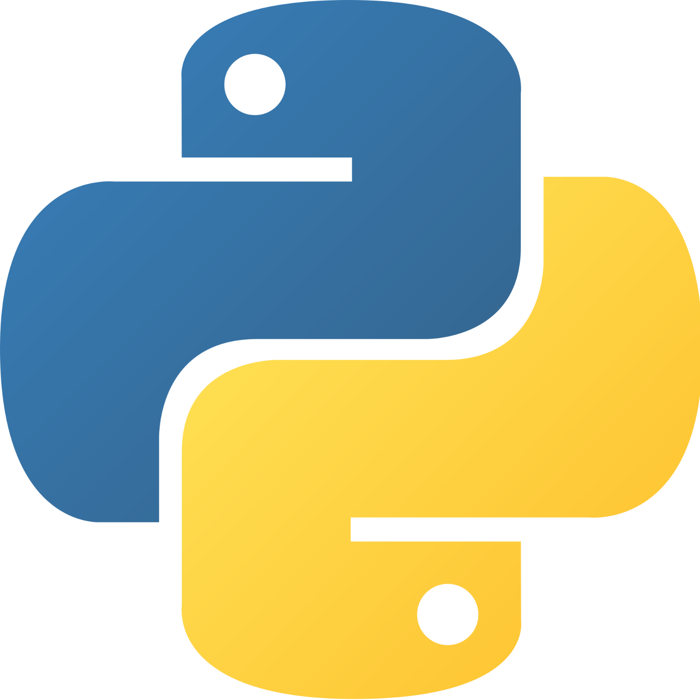
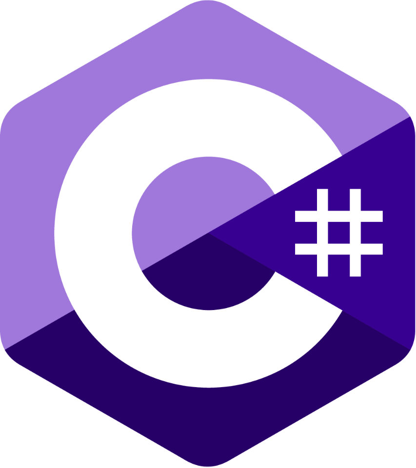
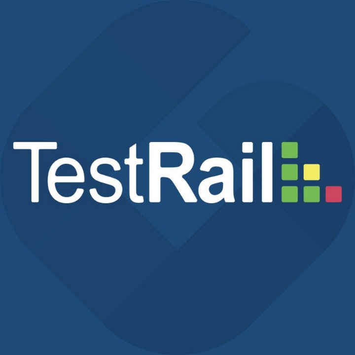

### Hi there 👋

**About me**

- 💼 I'm QA Engineer
- 🌱 I’m currently learning at QA.GURU
- 📫 How to reach me: Telegram @KpokoguJl

**Languages and Tools:**

<code></code>
<code></code>
<code></code>
<code></code>
<code></code>
<code></code>
<code></code>

# Диплом
<code></code>

В рамках обучения в школе <a href="QA.GURU">QA.GURU</a> была подготовлена выпускная работа.
Работа состоит из трех частей: автоматизация UI, API и Mobile App.

**Проект UI автотестов**
------------------------
<a href="https://github.com/KpokoguJl/qa_guru_diplom_ui"> Github</a>

<a href="https://jenkins.autotests.cloud/job/C10_SergeyChikov_qa_guru_10_diplom_ui/">  Jenkins</a>

<a href="https://allure.autotests.cloud/project/1122/dashboards/1985"> Allure TestOps Dashboard</a>

**Проект API автотестов**
------------------------
<a href="https://github.com/KpokoguJl/qa_guru_diplom_api"> Github</a>

<a href="https://jenkins.autotests.cloud/job/C10_SergeyChikov_qa_guru_10_diplom_api/"> Jenkins</a>

<a href="https://allure.autotests.cloud/project/1122/dashboards/2018"> Allure TestOps Dashboard</a>

**Проект Mobile автотестов**
------------------------
<a href="https://github.com/KpokoguJl/qa_guru_diplom_mobile"> Github</a>

<a href="https://jenkins.autotests.cloud/job/C10_SergeyChikov_qa_guru_10_diplom_mobile/"> Jenkins</a>

<a href="https://allure.autotests.cloud/project/1122/dashboards/2022"> Allure TestOps Dashboard</a>
